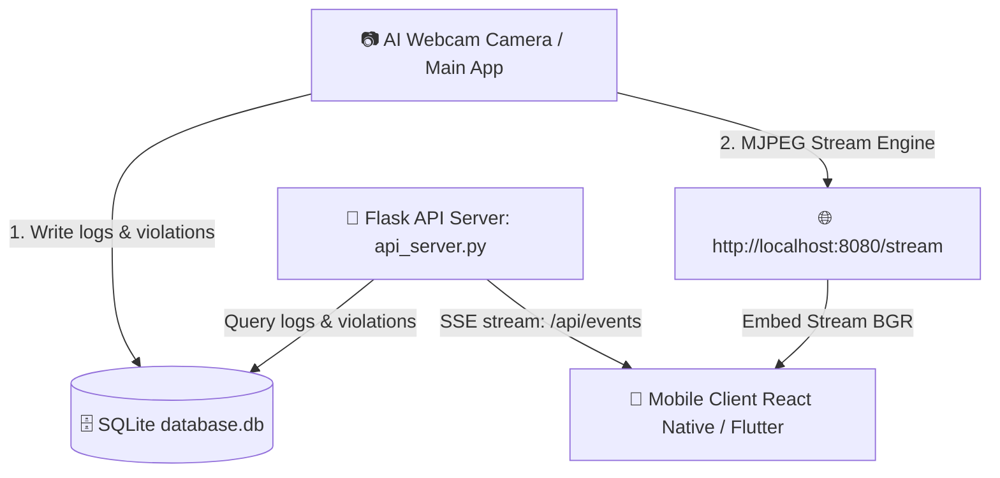

# 📱 Mobile Notification & Live Monitoring System for AI STEM Camera

This guide provides the complete architecture and code templates to monitor notifications and stream live video from your AI intelligent camera system (`Diem danh STEM`) on a mobile application.

---

## 🏗️ System Architecture

The mobile app links to the Python AI Camera system on your computer through the local network. 



---

## 🔌 1. The Backend API Server: `api_server.py`

I have created the backend API file: [api_server.py](file:///C:/Users/ADMIN/Desktop/Diem%20danh%20STEM/api_server.py). 

Run this script in the background on your computer alongside `main.py` using:
```bash
python api_server.py
```
This starts a server on port **5000** accessible by any mobile device on the same local Wi-Fi.

---

## 📱 2. Mobile Client Code: React Native (Expo)

This is a complete, beautifully styled mobile application code using **React Native with Expo**. It handles:
1. Connecting to the computer's local IP on ports `8080` (video stream) and `5000` (API logs).
2. Streaming the camera feed in real-time.
3. Subscribing to Server-Sent Events (SSE) for instant alerts when a scan or stranger is detected.
4. Displaying a list of recent check-ins and violations (with face pictures).
5. Triggering a local vibration or sound when a **Stranger** is detected.

Create an Expo project (`npx create-expo-app ClientApp`) and replace `App.js` with:

```javascript
import React, { useState, useEffect } from 'react';
import { StyleSheet, Text, View, Image, FlatList, TouchableOpacity, Alert, ActivityIndicator, Vibration } from 'react-native';
import { StatusBar } from 'expo-status-bar';

// ⚠️ REPLACE WITH YOUR COMPUTER'S LOCAL IP ADDRESS (e.g. 192.168.1.15)
const COMPUTER_IP = "192.168.1.15"; 
const API_URL = `http://${COMPUTER_IP}:5000`;
const STREAM_URL = `http://${COMPUTER_IP}:8080/stream`;

export default function App() {
  const [logs, setLogs] = useState([]);
  const [violations, setViolations] = useState([]);
  const [isConnected, setIsConnected] = useState(false);
  const [loading, setLoading] = useState(true);

  useEffect(() => {
    // 1. Initial Load of logs and violations
    fetchInitialData();

    // 2. Setup Realtime SSE Event Stream from computer
    const eventSource = new EventSource(`${API_URL}/api/events`);

    eventSource.addEventListener('log', (event) => {
      const newLog = JSON.parse(event.data);
      setLogs(prev => [newLog, ...prev.slice(0, 19)]);
    });

    eventSource.addEventListener('violation', (event) => {
      const newVio = JSON.parse(event.data);
      setViolations(prev => [newVio, ...prev.slice(0, 19)]);
      
      // Vibrate phone on violation
      Vibration.vibrate([0, 500, 200, 500]);
      
      Alert.alert(
        "⚠️ CANH BAO AN NINH",
        `Phát hiện: ${newVio.ho_ten} (${newVio.mo_ta}) lúc ${newVio.thoi_gian}`
      );
    });

    eventSource.onopen = () => {
      setIsConnected(true);
      setLoading(false);
    };

    eventSource.onerror = (err) => {
      setIsConnected(false);
      setLoading(false);
    };

    return () => {
      eventSource.close();
    };
  }, []);

  const fetchInitialData = async () => {
    try {
      const logRes = await fetch(`${API_URL}/api/logs`);
      const logsJson = await logRes.json();
      setLogs(logsJson);

      const vioRes = await fetch(`${API_URL}/api/violations`);
      const viosJson = await vioRes.json();
      setViolations(viosJson);
    } catch (e) {
      console.log("Error loading data:", e);
    }
  };

  const renderLogItem = ({ item }) => (
    <View style={styles.logCard}>
      <View style={styles.logHeader}>
        <Text style={styles.logName}>{item.ho_ten}</Text>
        <Text style={[styles.badge, item.trang_thai === 'Vao' ? styles.badgeIn : styles.badgeOut]}>
          {item.trang_thai === 'Vao' ? 'VÀO' : 'RA'}
        </Text>
      </View>
      <Text style={styles.logSub}>Mã HS: {item.ma_hs} | {item.thoi_gian}</Text>
    </View>
  );

  const renderVioItem = ({ item }) => (
    <View style={styles.vioCard}>
      {item.photo_url ? (
        <Image 
          source={{ uri: `${API_URL}${item.photo_url}` }} 
          style={styles.vioImage} 
        />
      ) : (
        <View style={[styles.vioImage, styles.noImage]}>
          <Text style={{color: '#888'}}>Không ảnh</Text>
        </View>
      )}
      <View style={styles.vioInfo}>
        <Text style={styles.vioTitle}>{item.ho_ten}</Text>
        <Text style={styles.vioReason}>{item.mo_ta}</Text>
        <Text style={styles.vioTime}>{item.thoi_gian}</Text>
      </View>
    </View>
  );

  return (
    <View style={styles.container}>
      <StatusBar style="light" />
      <View style={styles.header}>
        <Text style={styles.headerTitle}>Hệ Thống Giám Sát STEM</Text>
        <View style={[styles.statusDot, isConnected ? styles.statusOnline : styles.statusOffline]} />
      </View>

      {/* Live Stream Window */}
      <View style={styles.streamContainer}>
        {isConnected ? (
          <Image 
            source={{ uri: STREAM_URL }} 
            style={styles.stream} 
            resizeMode="contain"
          />
        ) : (
          <View style={styles.streamPlaceholder}>
            {loading ? (
              <ActivityIndicator size="large" color="#00ff66" />
            ) : (
              <Text style={styles.placeholderText}>Mất kết nối với Camera AI</Text>
            )}
          </View>
        )}
      </View>

      {/* Lists Section */}
      <View style={styles.listSection}>
        <View style={styles.listColumn}>
          <Text style={styles.columnHeader}>🔔 Vi Phạm / Người Lạ</Text>
          <FlatList
            data={violations}
            keyExtractor={(item) => `vio-${item.id}`}
            renderItem={renderVioItem}
            contentContainerStyle={styles.listContent}
          />
        </View>

        <View style={styles.listColumn}>
          <Text style={styles.columnHeader}>📝 Điểm Danh Gần Đây</Text>
          <FlatList
            data={logs}
            keyExtractor={(item) => `log-${item.id}`}
            renderItem={renderLogItem}
            contentContainerStyle={styles.listContent}
          />
        </View>
      </View>
    </View>
  );
}

const styles = StyleSheet.create({
  container: { flex: 1, backgroundColor: '#0d1117', paddingTop: 45 },
  header: { flexDirection: 'row', alignItems: 'center', justifyContent: 'space-between', paddingHorizontal: 15, paddingBottom: 10, borderBottomWidth: 1, borderBottomColor: '#21262d' },
  headerTitle: { fontSize: 18, fontWeight: 'bold', color: '#c9d1d9' },
  statusDot: { width: 12, height: 12, borderRadius: 6 },
  statusOnline: { backgroundColor: '#238636' },
  statusOffline: { backgroundColor: '#da3637' },
  streamContainer: { width: '100%', height: 240, backgroundColor: '#000', justifyContent: 'center', alignItems: 'center' },
  stream: { width: '100%', height: '100%' },
  streamPlaceholder: { justifyContent: 'center', alignItems: 'center' },
  placeholderText: { color: '#8b949e', fontSize: 14 },
  listSection: { flex: 1, flexDirection: 'row', padding: 10 },
  listColumn: { flex: 1, marginHorizontal: 5 },
  columnHeader: { fontSize: 14, fontWeight: 'bold', color: '#8b949e', marginBottom: 10, textTransform: 'uppercase' },
  listContent: { paddingBottom: 20 },
  logCard: { backgroundColor: '#161b22', padding: 10, borderRadius: 6, marginBottom: 8, borderWidth: 1, borderColor: '#30363d' },
  logHeader: { flexDirection: 'row', justifyContent: 'space-between', alignItems: 'center' },
  logName: { color: '#c9d1d9', fontWeight: 'bold', fontSize: 13 },
  logSub: { color: '#8b949e', fontSize: 11, marginTop: 4 },
  badge: { fontSize: 9, fontWeight: 'bold', paddingVertical: 2, paddingHorizontal: 6, borderRadius: 4, overflow: 'hidden' },
  badgeIn: { backgroundColor: '#238636', color: '#fff' },
  badgeOut: { backgroundColor: '#da3637', color: '#fff' },
  vioCard: { backgroundColor: '#211314', flexDirection: 'row', padding: 8, borderRadius: 6, marginBottom: 8, borderWidth: 1, borderColor: '#da3637' },
  vioImage: { width: 50, height: 50, borderRadius: 4, marginRight: 8 },
  noImage: { backgroundColor: '#30363d', justifyContent: 'center', alignItems: 'center' },
  vioInfo: { flex: 1, justifyContent: 'center' },
  vioTitle: { color: '#f85149', fontWeight: 'bold', fontSize: 12 },
  vioReason: { color: '#c9d1d9', fontSize: 11, marginTop: 2 },
  vioTime: { color: '#8b949e', fontSize: 9, marginTop: 2 }
});
```

---

## ⚡ 3. Quick Alternative: Telegram Bot Push Alerts

For STEM project presentations or quick deployments, creating a **Telegram Bot** is highly recommended. You will receive notifications directly on your Telegram Mobile App instantly, containing the image of the stranger.

Here is a script `telegram_bot.py` you can write to handle this. It works by monitoring database updates and forwarding violations to your Telegram Bot API:

```python
import os
import sqlite3
import time
import requests

# ⚠️ SETUP TELEGRAM BOT INFO
TOKEN = "YOUR_TELEGRAM_BOT_TOKEN"
CHAT_ID = "YOUR_TELEGRAM_CHAT_ID"

BASE_DIR = os.path.dirname(os.path.abspath(__file__))
DB_PATH = os.path.join(BASE_DIR, "data", "database.db")

def send_telegram_alert(message, image_path=None):
    try:
        if image_path and os.path.exists(image_path):
            url = f"https://api.telegram.org/bot{TOKEN}/sendPhoto"
            with open(image_path, 'rb') as img:
                payload = {'chat_id': CHAT_ID, 'caption': message}
                files = {'photo': img}
                requests.post(url, data=payload, files=files, timeout=10)
        else:
            url = f"https://api.telegram.org/bot{TOKEN}/sendMessage"
            payload = {'chat_id': CHAT_ID, 'text': message}
            requests.post(url, data=payload, timeout=10)
        print("[TELEGRAM] Alert sent successfully!")
    except Exception as e:
        print(f"[TELEGRAM ERROR] Failed to send alert: {e}")

def main():
    if not os.path.exists(DB_PATH):
        print(f"Database not found at {DB_PATH}. Wait for main.py to create it.")
        time.sleep(5)
        return

    conn = sqlite3.connect(DB_PATH)
    cur = conn.cursor()
    
    # Get current max ID so we don't spam old violations on startup
    cur.execute("SELECT MAX(id) FROM offline_violation")
    last_id = cur.fetchone()[0] or 0
    conn.close()
    
    print(f"[TELEGRAM BOT ACTIVE] Monitoring violations starting from ID {last_id}...")

    while True:
        time.sleep(2)
        try:
            conn = sqlite3.connect(DB_PATH)
            cur = conn.cursor()
            
            # Query for new violations
            cur.execute(
                "SELECT id, thoi_gian, ma_hs, ho_ten, mo_ta, duong_dan FROM offline_violation WHERE id > ? ORDER BY id ASC",
                (last_id,)
            )
            vios = cur.fetchall()
            
            for vio in vios:
                vid, ts, mahs, name, reason, path = vio
                last_id = vid
                
                alert_text = (
                    f"⚠️ 🚨 PHÁT HIỆN VI PHẠM AN NINH! 🚨 ⚠️\n\n"
                    f"⏰ Thời gian: {ts}\n"
                    f"👤 Đối tượng: {name} (Mã: {mahs})\n"
                    f"❌ Lý do: {reason}\n"
                )
                
                print(f"[TELEGRAM] New violation found (ID: {vid}). Sending...")
                send_telegram_alert(alert_text, path)
                
            conn.close()
        except Exception as e:
            print(f"[ERROR] {e}")
            time.sleep(5)

if __name__ == "__main__":
    main()
```
